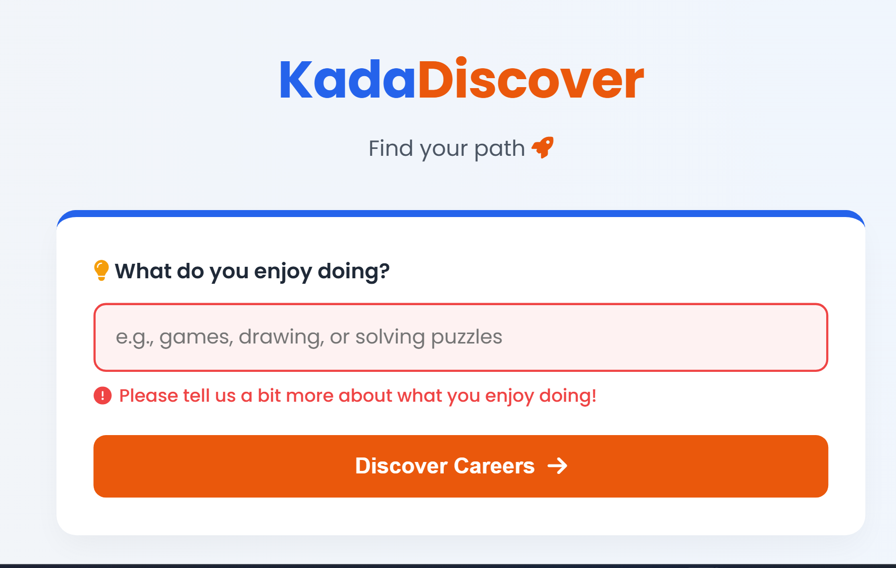
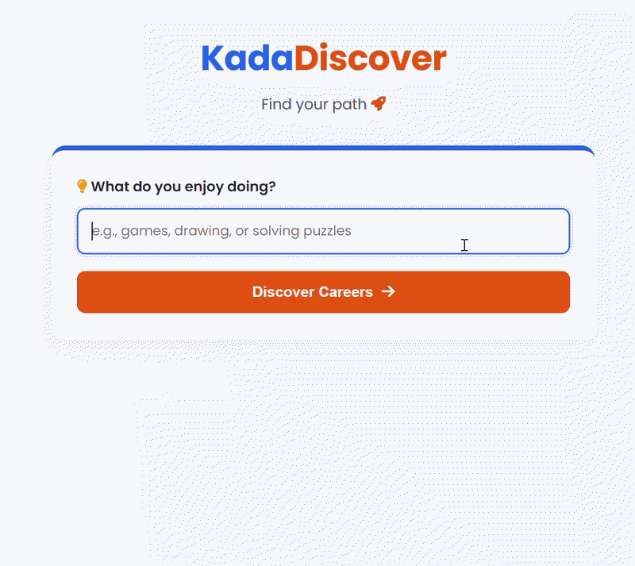

# KadaDiscover 🚀
An interactive AI Career Explorer designed specifically to help Filipino students find modern, tech-adjacent, and unconventional career paths based on their hobbies and interests.


<div align="center">
  <h3><a href="https://kadadiscover.netlify.app/">🌐 Try KadaDiscover Live Here!</a></h3>
</div>

## 📖 Product Overview

### The Problem: The Exposure Gap

Many students in the Philippines only know the "default" career paths (Nurse, Engineer, Teacher, IT). They lack exposure to modern, niche, or emerging roles that might perfectly align with their actual, everyday interests. Furthermore, due to the Access Gap, complex platforms with heavy videos or graphics are unusable on basic mobile data plans.

### The Solution: KadaDiscover

KadaDiscover is an ultra-lightweight, mobile-optimized web app. A student inputs casual, non-academic interests (e.g., "arguing with my siblings," "drawing," "organizing closets"). The AI synthesizes these traits to generate highly specific, unconventional career recommendations along with a localized "Day in the Life" micro-narrative.

### Why This Approach?

* **Why this problem:** You can't aim for a career you don't know exists. Closing the exposure gap is the first step before networking or skill-building can even begin.
* **Why AI:** Static career quizzes map predefined answers to predefined careers. Generative AI can weave disparate, highly personalized inputs into a coherent career recommendation and instantly generate an engaging, localized story that makes the career feel real to a Filipino student.
* **Assumptions made:** I assumed students might be intimidated by formal career assessments. Therefore, the UI asks casual, low-stakes questions to encourage engagement. I also assumed the target user is on a mobile device with limited bandwidth, so the UI is text-centric and fast.


<div align="center">
  
</div>


## 🌟 Features

* **AI-Powered Matching:** Uses Google's Gemini model to analyze user interests and generate accurate, creative insights.
* **Tailored Suggestions:** Generates customized career paths complete with localized "day in the life" stories.
* **Skill Identification:** Highlights specific hard and soft skills needed for each suggested path to help students start upskilling immediately.
* **Secure Architecture:** Built with a serverless backend to keep API keys hidden and completely secure from the client side.

## 🛠️ Tech Stack

* **Frontend:** HTML5, CSS3, Vanilla JavaScript
* **Backend:** Netlify Functions (Node.js)
* **AI Integration:** Google Gemini API
* **Deployment:** Netlify

## 🚀 How to Run Locally

If you want to fork this project or run it on your local machine, follow these steps:

1. **Clone the repository:**
```bash


git clone https://github.com/jhanerose/KadaDiscover.git
cd KadaDiscover-main

```

2.  **Install the Netlify CLI:**
```bash
npm install -g netlify-cli

```

3. **Set up your environment variables:**
Create a `.env` file in the root directory and add your Google Gemini API key:
```text

GEMINI_API_KEY="your_secret_key_here"
```

4.  **Start the local development server:**
```
    
netlify dev

```
> *Your app will typically be running on `http://localhost:8888`.*


## 🔒 Security Note

This project uses **Netlify Functions** to securely handle AI API requests. The `GEMINI_API_KEY` is safely stored in environment variables and is never exposed to the frontend browser, preventing unauthorized usage or quota theft.

## 🔮 Future Improvements

If I had more time, I would connect this to the Skill Gap problem by adding a "Start Learning" button under the AI story. This would generate a free, 3-step YouTube learning roadmap tailored to that specific career so students can begin right away.

## 🤖 AI Usage Reflection

* **AI Tools Used:** Google Gemini was used as a pair programmer and ideation partner.
* **How AI was used during development:** I used AI to help brainstorm the intersection of specific user pain points. Once I selected the "Exposure Gap," I asked the AI to help write a lightweight vanilla JavaScript template that mimics a backend LLM call.
* **Suggestions Accepted vs. Rejected:**
* *Rejected:* The AI initially suggested building an interactive graph or mind-map for career discovery. I rejected this because it conflicts with the "Access Gap"—complex D3.js or Canvas-based mind maps are heavy and perform poorly on low-end mobile devices.
* *Accepted:* I accepted the suggestion to use narrative text ("Day in the Life"). Text is emotionally engaging and incredibly cheap on bandwidth.


* **Manual Verification:** I verified the CSS responsiveness to ensure it looked good on a simulated mobile screen, and I tested the UX flow (Input -> Load -> Teaser -> Click for Story) to make sure it felt satisfying.

## 📈 Final Reflection

**If this feature grew to support thousands of students, what would you improve first and why?**

If this scaled to thousands of students, my first improvement would be **AI Output Caching and Vectorizing**. Currently, hitting an LLM API for every single query is slow and expensive. Since many students will likely input similar interests (e.g., "playing games and drawing"), I would implement a database (like Supabase or Redis) to store previous AI outputs. When a new student enters their interests, the system would check if a similar combination has already been asked. If so, it serves the cached response instantly. This would drastically reduce API costs, improve load times for users on slow connections, and ensure the platform remains financially sustainable as it scales.

